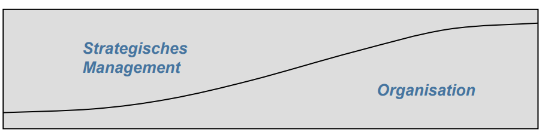

# Unternehmensführung und strategisches Management: Begriffe, Ebenen und Prozess
## Die Bedeutungen der Unternehmensführung
1. Kontrolle und Leitung eines Unternehmens
2. zielorientierte Interaktion mit den Unternehmensmitgeliedern
3. Funktionen wie Planung, Personalführung und Repräsentation
4. die Personen, die Führungsfunktion ausüben
5. Informationsgewinnung und Entscheidungsfindung
6. die zielorientierte Beeinflussung von Organisationsstrukturen
7. die gezielte Beeinflussung des Verhaltens anderer

## Aufgabe von Unternehmensführung (nach Ullrich)
Gestaltung, Steuerung und Entwicklung des komplexen Systems Unternehmen
### Funktionen der Unternehmensführung
- Sachbezogene Managmentfunktionen (Planung, Steuerung/Organisation, Kontrolle)
- Personenbezogene Managementfunktionen (Personalführung)

## Planung, Steuerung/Organisation und Kontrolle als Funktionen der (sachbezogenen) Unternehmensführung
### Kontrolle
- Ergebnisse messen
- Abweichungen ermitteln
- Anpassungsentscheidungen treffen und durchsetzen

### Steuerung/Organisation
- Aufgaben und Verantwortung festlegen
- Einsatz planen
- Mitarbeiter motivieren und anleiten

### Planung
- Ziel bestimmen
- Analysen durchführen
- Strategien und Maßnahmen formulieren und auswählen

## Management als rationaler, stark eingeschränkter und als emergenter Prozess
### Aktiver, rationaler Ansatz
- Management wird von Managern vorangetrieben
- Management kann klare Ziele erreichen
- Management folgt einem klaren und stringenten Prozess

Die Fähigkeit, das Unternehmen in Richtung
bestimmter Ziele zu beeinflussen: stark

### Emergenzprozess-Ansatz (Realistischster und operationaler Ansatz)
- Der Manager kann den Prozess (nur) teilweise kontrollieren (“innerhalb gewisser Handlungsspielräume manövrieren“)
- Mehrere Teilnehmer innerhalb des Unternehmens beeinflussen das Management
- Management ist ein komplizierter, dynamischer Prozess, der nicht vollständig durchgeplant werden kann

Die Fähigkeit, das Unternehmen in Richtung
bestimmter Ziele zu beeinflussen: mittel

### Reaktiver, eingeschränkter Ansatz
- Die Möglichkeiten des Managements sind extrem eingeschränkt
- Wenig oder keine Aussicht darauf, dass sich Manager oder andere Personen in die von ihnen gewünschte Richtung bewegen können
- Management kann wegen dieser Einschränkungen kaum wirksam werden

Die Fähigkeit, das Unternehmen in Richtung
bestimmter Ziele zu beeinflussen: niedrig

## Ökonomische Untersuchungen auf drei Ebenen

### Externe Ebene (Makroebene) - links
- Untersuchung unterschiedlicher Organisationen oder
gesamter Geschäftsbereiche
- Analyse ihrer Beziehungen und Verbindungen innerhalb der Markt- und Wettbewerbsdynamik

### (Interne) Makroebene (Mesoebene) - mittel
- Untersuchung der Strukturen und Prozesse in den Organisationen (Untereinheiten, Aufgabenzuordnung, Hierarchien, Kommunikation, ...)
- Analyse ihres Einflusses auf die Funktionsweise der Organisation

### (Interne) Mikroebene - rechts
- Untersuchung der Verhaltensmuster von Individuen und Gruppen, sowie der Determinanten des Verhaltens
- Analyse der Möglichkeiten zur Verhaltensänderung

## Fünf Bedeutungen und Definitionen von Strategie
### Strategie als Trick
- “Schachzug, um Gegner und Mitbewerber auszutricksen"

### Strategie als Position
- “Standort" des Produkts in den Märkten (marktorientiert, externe Stufe)
###                   
                ↑ nach außen
                ...
                ↓ nach innen
###
### Strategie als Perspektive*
- Grundlegende Art, Geschäfte zu betreiben und zu betrachten (unternehmensorientiert, interne Stufe)

*: “Strategie als verbindendes Thema, das den Maßnahmen und Entscheidungen eines Individuums oder eines Unternehmens einen Zusammenhang und eine Richtung gibt” (Grant)

### Strategie als Plan
- Beabsichtigter Handlungsablauf
- Zukunftsorientiert
- „integriertes Maßnahmenbündel“

###                   
                ↑ vorwärts
                ...
                ↓ zurück
###

### Strategie als Muster
- Realisierte Verhaltenskonsistenz über einen
Zeitraum hinweg
- Geschichtsorientiert (Blick zurück)

